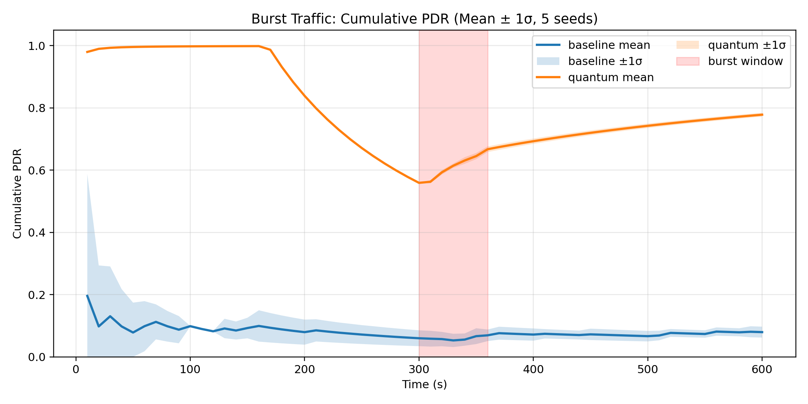
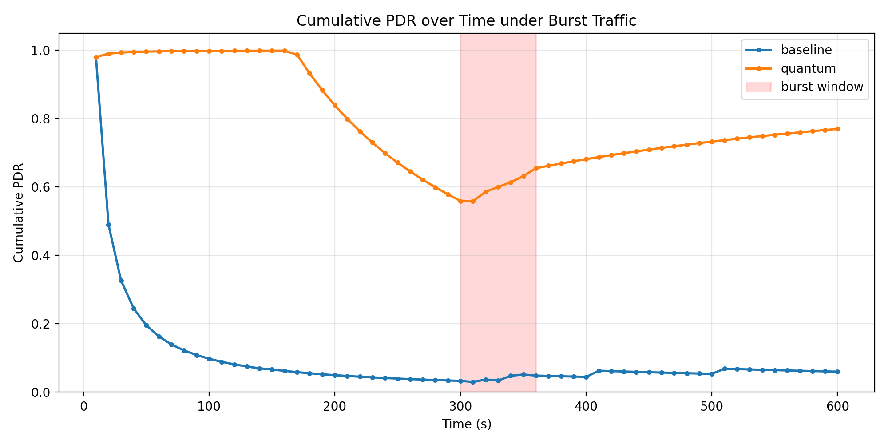

# Nghiên cứu: Quantum Routing + Cache trên LEO SatNet

## 1) Tóm tắt điều hành (Executive Summary)
- Bài toán: định tuyến vệ tinh LEO dưới tải động và burst traffic.
- Kết quả chính (kịch bản burst 600s, 5 seed): Quantum+Cache đạt độ tin cậy vượt trội so với baseline cổ điển.
- Điểm nổi bật triển khai: cache hit rate cao giúp hạ decision overhead xuống mức khả dụng thực tế.

---

## 2) Cấu hình thí nghiệm

| Hạng mục | Thiết lập |
|---|---|
| Simulator | SatSIM (event-driven) |
| Thời gian mô phỏng | 600 giây |
| Burst traffic | x3 tại t = 300–360 giây |
| Số seed | 5 (7, 11, 13, 17, 19) |
| So sánh | Baseline vs Quantum+Cache |
| Chỉ số | PDR, Delay, Decision Time, Cache Hit Rate, PDR theo thời gian |

---

## 3) Bảng kết quả tổng hợp (Burst 600s, 5 seed)

### 3.1 Kết quả chính (mean ± std)

| Method | PDR ↑ | Avg Delay (s) ↓ | Decision Time (ms) ↓ | Cache Hit Rate ↑ | Arrived | Dropped |
|---|---:|---:|---:|---:|---:|---:|
| Baseline | 0.0797 ± 0.0175 | 0.2226 ± 0.0032 | 0.00 ± 0.00 | 0.0000 ± 0.0000 | 286.8 ± 63.1 | 3311.2 ± 63.1 |
| Quantum+Cache | 0.7784 ± 0.0062 | 0.1368 ± 0.0015 | 29.05 ± 7.34 | 0.7167 ± 0.0000 | 2802.2 ± 22.2 | 796.8 ± 22.2 |

### 3.2 Chỉ số cải thiện suy diễn

| Chỉ số cải thiện | Giá trị |
|---|---:|
| PDR gain (Quantum/Baseline) | 9.77x |
| Delay reduction | 38.54% |
| Decision overhead (Quantum) | ~29.05 ms |
| Cache hit rate | 71.67% |

---

## 4) Phân tích theo thời gian (PDR)

### 4.1 Pha trước burst, trong burst, sau burst

| Mode | Pre-burst cumulative PDR (t=240–290) | Burst window PDR (t=300–350) | Post-burst cumulative PDR (t=360–420) |
|---|---:|---:|---:|
| Baseline | 0.0682 | 0.0669 | 0.0732 |
| Quantum+Cache | 0.6359 | 0.6805 | 0.6866 |

Nhận xét ngắn:
- Baseline ở trạng thái nghẽn sớm (early congestion collapse), duy trì PDR thấp.
- Quantum+Cache thể hiện graceful degradation trong burst và giữ ổn định sau burst.

---

## 5) Hình minh họa cần dùng cho paper

## 5.1 Hero chart (khuyến nghị dùng)



## 5.2 Chart seed mẫu (tham khảo)



---

## 6) Kết quả nền không-burst (600s, 5 seed)

| Method | PDR ↑ | Avg Delay (s) ↓ | Decision Time (s) ↓ |
|---|---:|---:|---:|
| Baseline | 0.0867 ± 0.0289 | 0.2224 ± 0.0045 | 0.0000 ± 0.0000 |
| Quantum | 0.7800 ± 0.0002 | 0.1421 ± 0.0000 | 0.1032 ± 0.0263 |

Ghi chú: ở kịch bản burst, bản Quantum+Cache đã giảm overhead đáng kể so với Quantum chưa cache.

---

## 7) Tuyên bố khoa học khuyến nghị (để tránh overclaim)
- Kết luận dựa trên mô phỏng SatSIM với 5 seed độc lập.
- Khẳng định chính: **Quantum+Cache cải thiện mạnh reliability và delay dưới burst traffic**.
- Không overclaim về thời gian chạy QPU phần cứng thực tế (đây là runtime trong mô phỏng).

---

## 8) Phụ lục tái lập (Reproducibility)

### 8.1 File dữ liệu gốc
- [burst_traffic_600s_cached_multiseed_summary.csv](burst_traffic_600s_cached_multiseed_summary.csv)
- [burst_traffic_600s_cached_multiseed_timeseries.csv](burst_traffic_600s_cached_multiseed_timeseries.csv)
- [system_metrics_loopguard_600s_summary.csv](system_metrics_loopguard_600s_summary.csv)

### 8.2 Lệnh chạy burst benchmark (1 seed)

```bash
python experiments/burst_traffic_benchmark.py \
  --seconds 600 \
  --seed 7 \
  --packet-interval 0.2 \
  --burst-start 300 \
  --burst-duration 60 \
  --burst-multiplier 3 \
  --output-prefix experiments/output/burst_traffic_600s_seed7_cached
```

### 8.3 Lệnh chạy multi-seed

```bash
for s in 7 11 13 17 19; do
  python experiments/burst_traffic_benchmark.py \
    --seconds 600 \
    --seed "$s" \
    --packet-interval 0.2 \
    --burst-start 300 \
    --burst-duration 60 \
    --burst-multiplier 3 \
    --output-prefix experiments/output/burst_traffic_600s_seed${s}_cached
done
```

---

## 9) Checklist xuất PDF bằng Obsidian
- Mở file này trong Obsidian.
- Chuyển Preview mode để kiểm tra bảng/hình.
- Dùng lệnh Export to PDF.
- Nếu hình không hiện, đảm bảo file `.md` và `.png` giữ nguyên tương quan thư mục `experiments/output`.
